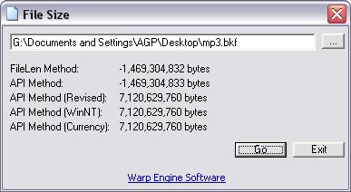



## Get File Sizes of Large Files

### Description

Gets the correct value for file sizes when the file is large (> ~2.1GB). Basically the file size function included in VB will give a wrong value when used on large files. The traditional way of getting the file size via API will also not work as detailed in the MS article http://support.microsoft.com/default.aspx?scid=kb;en-us;185476. After a bit of research I ended up tweaking the API function to calculate the proper file size. To see the differences, browse to a large file. Let me know if there are any bugs or suggestions to improve performance.
 
### More Info
 

             |
---                |---
**Submitted On**   |2003-11-13 17:41:28
**By**             |[El Mariachi](https://github.com/Planet-Source-Code/PSCIndex/blob/master/ByAuthor/el-mariachi.md)
**Level**          |Intermediate
**User Rating**    |5.0 (20 globes from 4 users)
**Compatibility**  |VB 5\.0, VB 6\.0
**Category**       |[Files/ File Controls/ Input/ Output](https://github.com/Planet-Source-Code/PSCIndex/blob/master/ByCategory/files-file-controls-input-output__1-3.md)
**World**          |[Visual Basic](https://github.com/Planet-Source-Code/PSCIndex/blob/master/ByWorld/visual-basic.md)
**Archive File**   |[Get\_File\_S16716311132003\.zip](https://github.com/Planet-Source-Code/el-mariachi-get-file-sizes-of-large-files__1-49884/archive/master.zip)

### API Declarations

Several are listed in the code.

